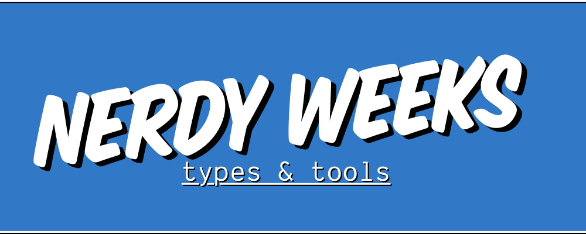

# Nerdy Weeks Types & Tools


<!-- @import "[TOC]" {cmd="toc" depthFrom=1 depthTo=6 orderedList=false} -->

<!-- code_chunk_output -->

- [Nerdy Weeks Types & Tools](#nerdy-weeks-types--tools)
  - [Prerequisites](#prerequisites)
  - [Setup](#setup)
  - [VSCode Things](#vscode-things)
    - [Extension](#extension)
    - [Fonts](#fonts)
    - [Color & Icon Theme](#color--icon-theme)
    - [Settings](#settings)
  - [Exercises](#exercises)

<!-- /code_chunk_output -->

## Prerequisites

- git v2 or greater
- NodeJS v10 or greater
- npm v6 or greater
- VSCode latest
  
Test if they exists

```bash
git --version
node --version
npm --version
```
## Setup 

To get started and install all dependencies for you run the following commands in your terminal.

```bash
git clone git@github.com:technologiestiftung/nerdy-weeks-types-and-tools.git
cd nerdy-weeks-types-and-tools
npm run setup --quiet
```

This will use [lerna](https://lerna.js.org/) to install all dependencies in the subfolders, so you don't have to.

When done open the folder `nerdy-weeks-types-and-tools` with VSCode to get started.

## VSCode Things 

### Extension

When opening this project with VSCode it should ask to install or review recommended extension. You will need to enable them one by one.

The folder `./vscode-things` contains a script to install all the recommended extension from the shell. Make sure that the VSCode cli is available in your `PATH` and review the script you will have to remove an `exit 0` command.

```bash
./vscode-things/install-all.sh
```

### Fonts

The current font of choice is [Dank Mono](https://gumroad.com/l/dank-mono) which is not free but meh!… Not everything is free. An alternative monospaced font with ligatures and italics for VSCode could be:

- [Operator Mono](https://www.typography.com/fonts/operator/styles/operatormono)
- [Victor Mono (free)](https://rubjo.github.io/victor-mono/) 
- [Fira Code (free, no italics)](https://github.com/tonsky/FiraCode)

You might also need these fonts if you use powerline fonts in your terminal:

- [Powerline fonts (has e.g. "Fira Mono for Powerline")](https://github.com/powerline/fonts) 

To enable italics you need to add some settings to your VSCode.  You will find them also in the file `.vscode/fabianmoronzirfas.settings.json`

```json
{
  "editor.tokenColorCustomizations": {
    "textMateRules": [
        {
            "scope": "comment",
            "settings": {
                "fontStyle": "italic"
            }
        },
        {
            "scope": "keyword",
            "settings": {
                "fontStyle": "italic"
            }
        },
        {
            "scope": "language",
            "settings": {
                "fontStyle": "italic"
            }
        }
    ]
  }
}
```

### Color & Icon Theme

The color theme of choice os the [Nord theme](https://www.nordtheme.com/). Which can be found for many different editors or shells

### Settings

There is a full copy of my VSCode settings under `vscode-things/fabianmoronzirfas.settings.json`. Just open your settings by hitting `⌘ + ,` and opening them as a file by clicking the little file icon on the upper right. Just paste it all or take what you need.


## Exercises 

For the exercises you will find the following folder structures displayed below. In the folder `./final` you will find all the results we hope to achieve on that day. Under `./start` you can find some boilerplate projects so you don't have to configure everything by yourself.


```plain
.
├── final
│   ├── server
│   ├── client
│   └── typescript
└── start
    ├── server
    ├── client
    └── typescript
```

Best way to work will be to open these folders in a new VSCode window.
For example by running 

```bash
# For the typescript examples
# you should create a copy of the folder ex_ 
# So you don't have all in one file
cp -R ./start/typescript/ex_ ./start/typescript/ex1 && code ./start/typescript/ex1 -n
# For the react client project
code ./start/client/ -n
# For the express REST api server project
code ./start/server/ -n
```